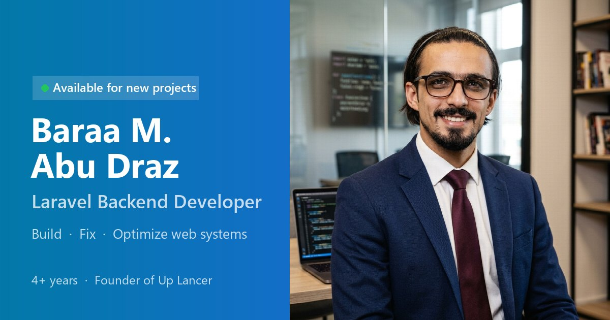

<p align="center">
  
</p>

<h1 align="center">Baraa Abu Draz — Portfolio</h1>

<p align="center">
  A bilingual (Arabic / English) portfolio and client-acquisition site for a Laravel backend developer,<br>
  with a built-in CMS, SEO, and WhatsApp-first contact.
</p>

<p align="center">
  
  
  
  
  
</p>

---

## Contents

- [Features](#features)
- [Tech stack](#tech-stack)
- [Getting started](#getting-started)
- [Configuration](#configuration)
- [Managing content](#managing-content)
- [SEO](#seo)
- [Project structure](#project-structure)
- [Testing & code style](#testing--code-style)
- [Deployment checklist](#deployment-checklist)
- [Known limitations](#known-limitations)
- [Contact](#contact)

## Features

**Public site** — built to turn visitors into clients
- Hero with photo and a clear value proposition, services with deliverables, a "Who Am I" section, work process, projects, skills, and experience timeline
- Project case-study pages: challenge & solution, work stages, tech stack, "I want something similar" call-to-action, share buttons, previous/next navigation
- Contact form that opens **WhatsApp** or email with a pre-filled message (nothing is stored), plus a floating WhatsApp sticker
- In-page **CV viewer** and download
- 4 colour themes (light, dark, ocean, sunset) shared across all pages
- Full **Arabic (RTL)** and **English** support; Arabic is the default

**Admin CMS** (`/admin`)
- Manage services, projects, experience, skills, and site settings — every text field in both languages
- Upload project covers and the CV (PDF)
- Dashboard with a website-health checklist and a live Google search preview
- Light / dark mode and a mobile-friendly layout

**Quality**
- Accessibility: skip link, visible focus, `prefers-reduced-motion`, 44 px touch targets, WCAG-AA colour contrast
- SEO: canonical + `hreflang`, Open Graph / Twitter cards, JSON-LD, dynamic sitemap and robots.txt

## Tech stack

| Area | Tools |
|---|---|
| Backend | Laravel 13, PHP 8.5 |
| Data | SQLite via a small PDO service (`App\Services\Database`) |
| Frontend | Blade, hand-written CSS (no build step), Font Awesome, Google Fonts |
| Fonts | Plus Jakarta Sans + Inter (EN), Cairo (AR, public), IBM Plex Sans Arabic (admin) |
| Tooling | PHPUnit, Laravel Pint, Laravel Boost |

## Getting started

### Requirements
- PHP **8.5** with the `pdo_sqlite`, `mbstring`, and `fileinfo` extensions
- Composer

### Install

```bash
git clone https://github.com/Baraaabudraz/my_protoflio.git
cd my_protoflio
composer install
```

### Environment

> **Note:** this app reads its environment from **`.laravel.env`**, not `.env` (see `bootstrap/app.php`).

```bash
cp .laravel.env.example .laravel.env
php artisan key:generate   # writes APP_KEY into .laravel.env
```

Set at least `APP_URL` and `ADMIN_PASSWORD` — see [Configuration](#configuration). `.laravel.env` is ignored by Git; never commit it.

### Database

Site content lives in **`database/portfolio.sqlite`**, which is **not tracked by Git** (`*.sqlite*` is ignored).

- **Existing site:** copy your `portfolio.sqlite` into `database/`, then run `php artisan migrate` to apply any new migrations. Existing tables and content are kept.
- **Fresh install:** create an empty database and build the schema:

```bash
touch database/portfolio.sqlite
php artisan migrate
```

Laravel's default connection is SQLite and points at the same file the app reads through `App\Services\Database`.

### Run

```bash
php artisan serve
```

- Site: <http://127.0.0.1:8000> (Arabic) · <http://127.0.0.1:8000/?lang=en> (English)
- Admin: <http://127.0.0.1:8000/admin>

## Configuration

Key variables in `.laravel.env`:

| Variable | Purpose |
|---|---|
| `APP_URL` | Public URL. Used for canonical links, the sitemap, and social previews — must be your real `https://` domain in production. |
| `APP_KEY` | Encryption key (`php artisan key:generate`). |
| `APP_ENV` / `APP_DEBUG` | Use `production` / `false` on the live server. |
| `ADMIN_PASSWORD` | Password for `/admin`. Required outside local development — **admin login is disabled until it is set**. (Locally it falls back to `admin123`.) |
| `DB_CONNECTION` | `sqlite`. `DB_DATABASE` is optional and defaults to `database/portfolio.sqlite`. |

Everything else — name, texts, WhatsApp number, social links, SEO title/description, CV — is edited in **Admin → Settings**.

## Managing content

| Admin page | What it controls |
|---|---|
| **Settings** | Hero text, "Who Am I" paragraphs, stats, email, WhatsApp, GitHub/LinkedIn, CV upload, SEO title & description, footer |
| **Services** | Service cards (icon, title, summary, deliverables) |
| **Projects** | Project cards and case-study pages (cover, client, duration, category, overview, work stages, stack, links) |
| **Experience** | Career timeline |
| **Skills** | Skill categories with progress bars or tags |

Every text field has an English and an Arabic version; empty Arabic fields fall back to English. Interface strings live in `lang/ar.json` and `lang/en.json`.

## SEO

- Language is part of the URL: `/` is Arabic (default), `/?lang=en` is English — both indexable, linked with `hreflang`.
- `GET /sitemap.xml` — every page in both languages, generated from the database.
- `GET /robots.txt` — points crawlers to the sitemap. The admin URL is intentionally not listed; admin pages send `noindex`.
- JSON-LD: `Person`, `ProfessionalService` (with services), `WebSite`, `ProfilePage`; project pages add `CreativeWork` + `BreadcrumbList`.
- Social share image: `public/images/og-image.jpg` (1200×630).

## Project structure

```
app/
  Http/Controllers/
    PortfolioController.php    # home page + project pages
    AdminController.php        # CMS (auth, CRUD, settings, dashboard)
    SeoController.php          # sitemap.xml, robots.txt
  Http/Middleware/SetLocale.php  # ?lang= / session locale, localized URLs
  Services/
    Database.php               # PDO access to database/portfolio.sqlite
    SeoBuilder.php             # meta tags + JSON-LD
  helpers.php                  # t(), ts(), project_image_url()
resources/views/
  portfolio.blade.php          # home page
  project-detail.blade.php     # project case study
  partials/                    # seo, theme-tokens, whatsapp-sticker
  admin/                       # CMS views
lang/ar.json, lang/en.json     # UI translations
public/cv/                     # uploaded CV (PDF)
```

## Testing & code style

```bash
php artisan test --compact   # run the test suite
vendor/bin/pint              # format PHP (Laravel preset)
```

> Tests read from `database/portfolio.sqlite` (the PDO service has no separate test database). They are read-only — keep new tests that way, and back up the database before any test that writes.

## Deployment checklist

- [ ] `.laravel.env` created on the server from `.laravel.env.example` with its own `php artisan key:generate`
- [ ] `APP_URL=https://your-domain.com`, `APP_ENV=production`, `APP_DEBUG=false`
- [ ] Strong `ADMIN_PASSWORD` set **on the server only**
- [ ] `database/portfolio.sqlite` copied to the server (it is not in Git) and kept backed up
- [ ] `php artisan migrate --force`
- [ ] Writable by the web server: `storage/`, `bootstrap/cache/`, `database/` (SQLite writes), `public/cv/`, and `storage/app/public`
- [ ] `php artisan storage:link` (project cover uploads)
- [ ] `php artisan config:cache && php artisan route:cache && php artisan view:cache`
- [ ] Submit `https://your-domain.com/sitemap.xml` in Google Search Console

## Known limitations

- **Admin authentication** is a single shared password stored in the environment, not Laravel user accounts.
- Eloquent models in `app/Models` are unused — data access goes through `App\Services\Database`.

## Contact

**Baraa Abu Draz** — Laravel Backend Developer, founder of Up Lancer

[LinkedIn](https://www.linkedin.com/in/baraa-abudraz) · [GitHub](https://github.com/Baraaabudraz) · [abudrazbaraa@gmail.com](mailto:abudrazbaraa@gmail.com)

---

<sub>Personal portfolio project. No open-source licence is granted; all rights reserved.</sub>
